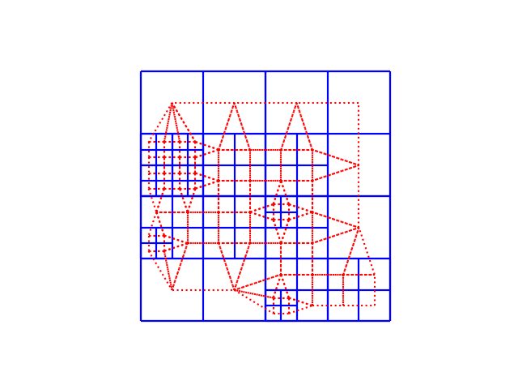

# octree-dual
A simple python implementation of the paper [Fast generation of pointerless octree duals](https://www.cs.jhu.edu/~misha/ReadingSeminar/Papers/Lewiner10.pdf) in 2D (quadtree).

## How to run
The script requires `numpy`, `matplotlib`, and `pymorton` to run. You can install `pymorton` by
```bash
pip install pymorton
```
After installing the dependencies, you can run the script by
```bash
python octree_dual.py
```
which will generate a random quadtree and its duals, and display them. Here is an example output:



The blue grid is the quadtree and the red grid is the duals.
